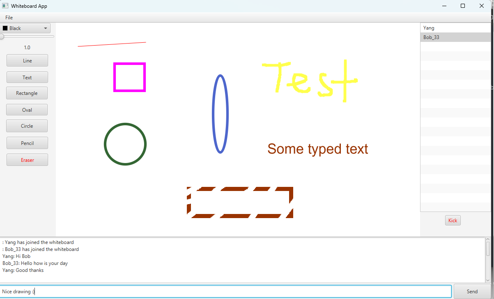

# Distributed Whiteboard App

This is a distributed whiteboard application that utilises Java RMI for the server and JavaFX library for the GUI interface

<p align="center"> 
    
 </p>

## Running the server 
```
java -jar WhiteboardServer.jar "host IP" "port"
```

## Running the app
```
java -jar WhiteboardApp.jar "host IP" "port" "username"
```
