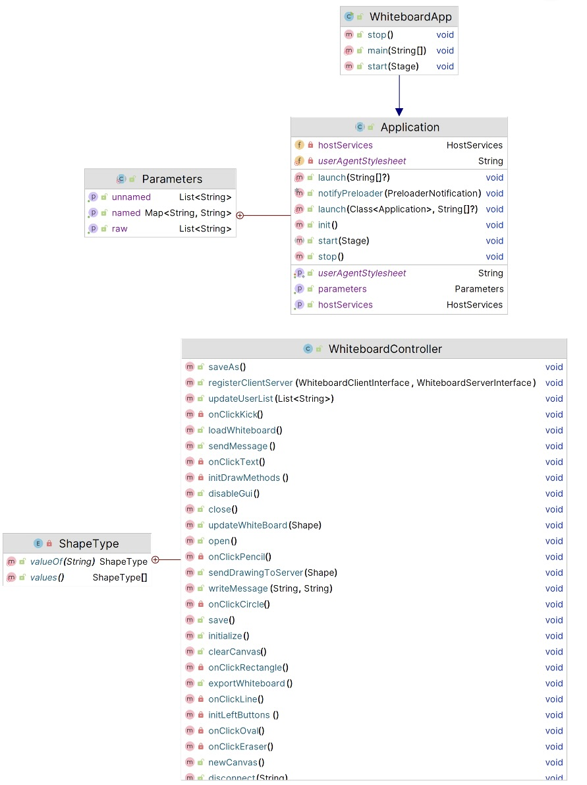

# Distributed Whiteboard App

This is a distributed whiteboard application that utilises Java RMI for the server and JavaFX library for the GUI interface

<p align="center"> 
    
 </p>

## Running the server 
```
java -jar WhiteboardServer.jar "host IP" "port"
```

## Running the app
```
java -jar WhiteboardApp.jar "host IP" "port" "username"
```

## System Design
<figure align="center">
    
    <figcaption>Figure 1: Whiteboard Application and Controller Class Diagram.</figcaption>
</figure>

---

<figure align="center">
    
    <figcaption>Figure 2: Whiteboard Server and Client Interaction Diagram.</figcaption>
</figure>

---

<figure align="center">
    
    <figcaption>Figure 3: Shape Interface Class Diagram.</figcaption>
</figure>
